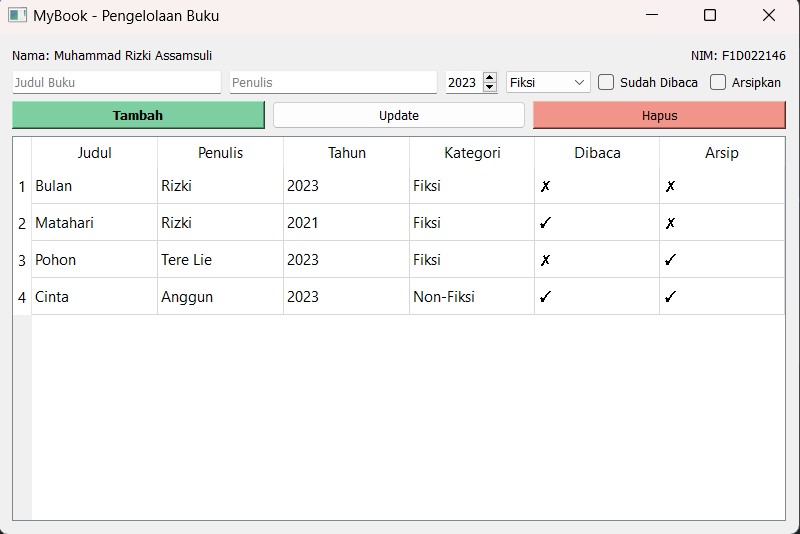

# 📚 MyBook - Aplikasi Pengelolaan Buku (PyQt5)


## Deskripsi Aplikasi

"MyBook" adalah aplikasi berbasis GUI menggunakan PyQt5 untuk mengelola daftar buku. Pengguna dapat menambahkan, memperbarui, dan menghapus data buku melalui antarmuka yang sederhana.

- **Nama:** Muhammad Rizki Assamsuli
- **NIM:** F1D022146

---

## 🛤️ Alur Program

1. **Inisialisasi Aplikasi**

   - Program dimulai dari fungsi `main()` di `logic.py`.
   - Membuat instance `QApplication` dan menampilkan `MyBookApp` dari `ui.py`.

2. **Pembuatan Antarmuka (UI)**

   - `ui.py` bertanggung jawab untuk membangun tampilan:
     - Form input: Judul, Penulis, Tahun, Kategori, Sudah Dibaca, Arsipkan.
     - Tombol aksi: Tambah, Update, Hapus.
     - Tabel untuk menampilkan daftar buku.

3. **Interaksi dengan Pengguna**
   - Tombol **Tambah**:
     - Mengambil data dari form.
     - Memvalidasi input (judul dan penulis wajib diisi).
     - Menyimpan data ke list `books`.
   - Tombol **Update**:
     - Mengubah data buku yang dipilih pada tabel berdasarkan form.
   - Tombol **Hapus**:
     - Menghapus data buku yang dipilih setelah konfirmasi.
4. **Pembaruan Tampilan**

   - Setiap kali data buku berubah (tambah, update, hapus), tabel diperbarui untuk menampilkan data terbaru.

5. **Pemilihan Data**

   - Ketika baris tabel diklik, data dari buku yang dipilih akan otomatis dimuat ke form input untuk diedit.

6. **Akhir Program**
   - Aplikasi akan terus berjalan hingga pengguna menutup jendela utama.

---

## ▶️ Cara Menjalankan

1. Install PyQt5 terlebih dahulu:
   ```bash
   pip install PyQt5
   ```
2. Jalankan program melalui logic.py

   ```bash
   python logic.py
   ```

---

## 📷 Hasil Run Aplikasi


