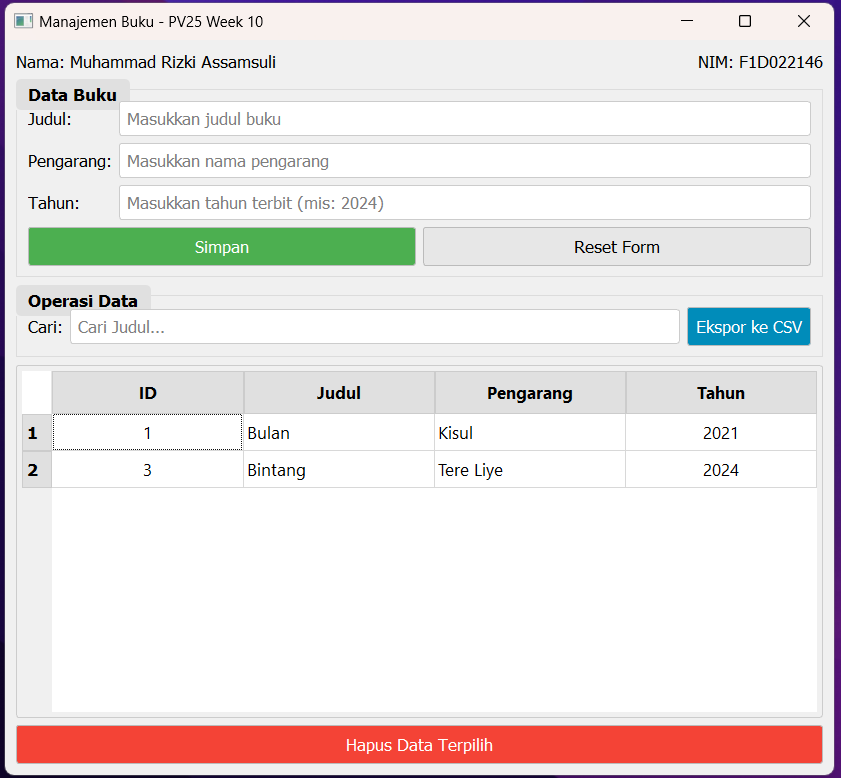

# 📚 Aplikasi Manajemen Buku (pv25-week10)

Aplikasi desktop ini dibuat menggunakan **PyQt5** dan **SQLite** untuk memenuhi tugas minggu ke-10 mata kuliah Pemrograman Visual. Aplikasi ini memungkinkan pengguna untuk mengelola data buku, meliputi operasi dasar **CRUD** (Create, Read, Update, Delete) serta fungsionalitas untuk **mengekspor data ke format CSV**.

- **Nama:** Muhammad Rizki Assamsuli
- **NIM:** F1D022146

---

## 🎯 Tujuan Aplikasi

Tujuan utama dari aplikasi ini adalah untuk mengimplementasikan sistem manajemen data buku yang fungsional dengan antarmuka pengguna grafis (GUI) yang interaktif. Aplikasi ini mencakup:

- Penggunaan `PyQt5` untuk membangun antarmuka pengguna desktop.
- Integrasi dengan database `SQLite` untuk persistensi data.
- Implementasi operasi **CRUD** (Create, Read, Update, Delete) pada data buku.
- Fitur pencarian data buku berdasarkan judul.
- Fitur ekspor data ke format `.csv`.
- Menampilkan identitas pembuat (Nama dan NIM) pada antarmuka sebagai tanda otentisitas.

---

## 🛠️ Fitur Aplikasi

1.  **Input Data Buku**:
    - Formulir input untuk **Judul**, **Pengarang**, dan **Tahun** terbit buku.
    - Tombol **Simpan** untuk menambahkan data baru atau memperbarui data yang sudah ada ke database SQLite.
2.  **Tampilan Data**:
    - Data buku ditampilkan dalam `QTableWidget` yang memuat **ID**, **Judul**, **Pengarang**, dan **Tahun**.
    - Tabel akan otomatis diperbarui setelah operasi tambah, ubah, atau hapus data.
3.  **Pencarian Data**:
    - Kotak pencarian untuk memfilter data buku secara _real-time_ berdasarkan **Judul**.
4.  **Edit dan Hapus Data**:
    - **Edit**: _Double-click_ pada baris tabel akan memuat data buku ke formulir input untuk diedit.
    - **Hapus**: Tombol **Hapus Data Terpilih** untuk menghapus satu atau beberapa data buku yang dipilih dari database.
5.  **Ekspor ke CSV**:
    - Tombol **Ekspor ke CSV** untuk menyimpan seluruh data buku dari database ke dalam sebuah file `.csv`, lengkap dengan header kolom.
6.  **Antarmuka Pengguna**:
    - Desain antarmuka yang sederhana dan intuitif.
    - Menampilkan Nama dan NIM mahasiswa di bagian atas jendela aplikasi.

---

## 🧩 Alur Kerja Aplikasi

1.  Aplikasi dijalankan dan jendela utama "Manajemen Buku" ditampilkan.
2.  Pengguna dapat melihat data buku yang sudah ada (jika ada) pada tabel.
3.  **Menambah Data**:
    - Isi field "Judul", "Pengarang", dan "Tahun" pada grup "Data Buku".
    - Klik tombol "Simpan". Data baru akan tersimpan dan tabel diperbarui.
4.  **Mencari Data**:
    - Ketikkan judul buku pada kotak "Cari Judul...". Tabel akan otomatis menampilkan hasil pencarian.
5.  **Mengedit Data**:
    - _Double-click_ pada baris buku di tabel yang ingin diedit.
    - Data buku tersebut akan muncul di field input.
    - Ubah data yang diinginkan, lalu klik tombol "Update Data" (tombol "Simpan" akan berubah teksnya).
6.  **Menghapus Data**:
    - Pilih satu atau beberapa baris buku di tabel.
    - Klik tombol "Hapus Data Terpilih". Konfirmasi penghapusan akan muncul. Jika "Yes", data akan dihapus.
7.  **Mengekspor Data**:
    - Klik tombol "Ekspor ke CSV".
    - Pilih lokasi dan nama file untuk menyimpan data dalam format `.csv`.
8.  **Reset Form**:
    - Klik tombol "Reset Form" untuk mengosongkan field input dan membatalkan mode edit.

---

## 📷 Hasil Run Aplikasi

**Contoh Tampilan Utama:**
