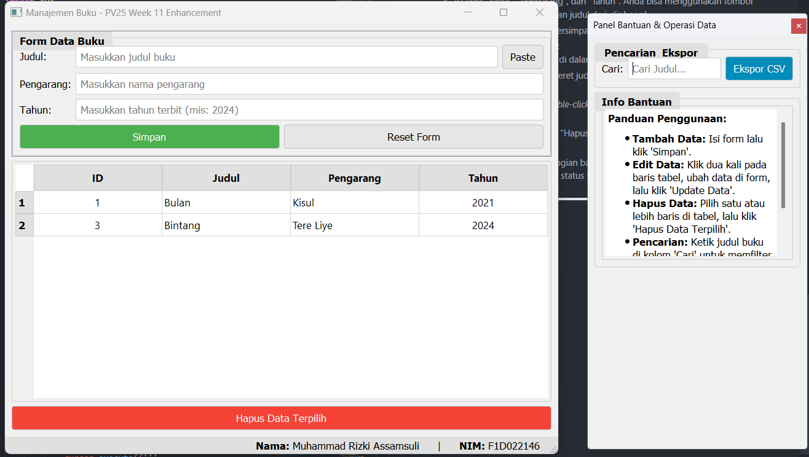
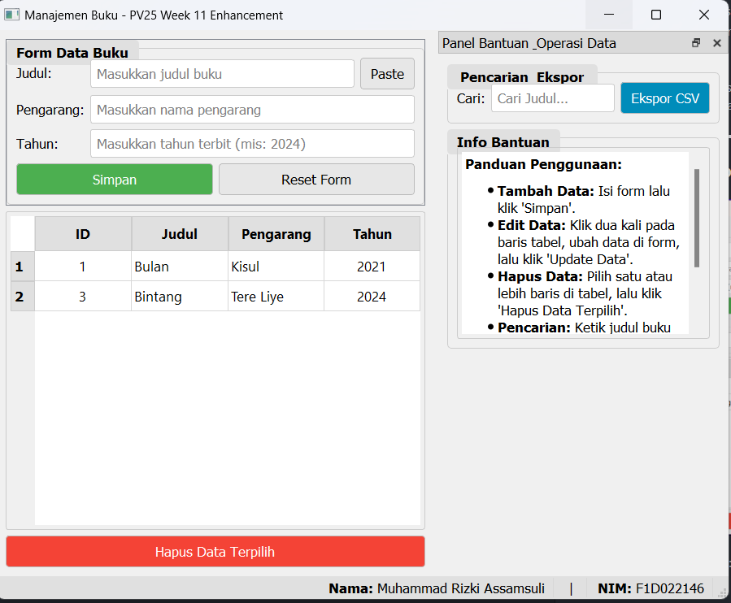

# 📚 Aplikasi Manajemen Buku (pv25-week11)

Aplikasi desktop ini merupakan **peningkatan** dari proyek CRUD minggu ke-10, yang dikembangkan menggunakan **PyQt5** dan **SQLite**. Proyek ini memenuhi tugas minggu ke-11 mata kuliah Pemrograman Visual dengan menambahkan fitur-fitur antarmuka canggih untuk meningkatkan fungsionalitas dan pengalaman pengguna.

- **Nama:** Muhammad Rizki Assamsuli
- **NIM:** F1D022146

---

## 🎯 Tujuan Peningkatan Aplikasi

Tujuan utama dari peningkatan ini adalah untuk memperkaya aplikasi manajemen buku dengan fitur-fitur UI lanjutan, yang meliputi:

- Mengimplementasikan semua fungsi dasar **CRUD** (Create, Read, Update, Delete) dengan stabil.
- Mengintegrasikan fungsionalitas **clipboard** (`QClipboard`) untuk mempercepat proses input data.
- Menggunakan **dockable widget** (`QDockWidget`) untuk menyajikan komponen UI (seperti pencarian dan bantuan) secara fleksibel dan tidak menghalangi area kerja utama.
- Menampilkan informasi persisten (Nama dan NIM) di **status bar** (`QStatusBar`) yang selalu terlihat.
- Memastikan antarmuka tetap responsif dan fungsional pada berbagai ukuran jendela dengan implementasi **scroll area** (`QScrollArea`).

---

## ✨ Fitur Baru dan Peningkatan

Selain fitur-fitur dasar dari minggu sebelumnya, aplikasi ini kini memiliki peningkatan signifikan:

1.  **Panel Operasi Fleksibel (`QDockWidget`)**:

    - Fitur pencarian, ekspor CSV, dan panel bantuan kini berada di dalam sebuah _dock widget_.
    - Panel ini dapat **dilepas (undocked)** dari jendela utama, dipindahkan, atau disematkan di sisi kiri atau kanan, memberikan keleluasaan tata letak bagi pengguna.

2.  **Integrasi Clipboard (`QClipboard`)**:

    - Sebuah tombol **"Paste"** ditambahkan di sebelah field input "Judul".
    - Memungkinkan pengguna untuk menempelkan teks langsung dari clipboard, mempercepat pengisian formulir.

3.  **Status Bar Informatif (`QStatusBar`)**:

    - **Nama dan NIM** mahasiswa kini ditampilkan secara permanen di bagian bawah kanan jendela.
    - Status bar juga memberikan **umpan balik** kepada pengguna setelah melakukan aksi, seperti "Data berhasil disimpan" atau "Teks dari clipboard berhasil ditempel".

4.  **Form Input Scrollable (`QScrollArea`)**:

    - Formulir untuk input data buku kini dibungkus dalam `QScrollArea`.
    - Jika tinggi jendela tidak mencukupi, sebuah _scrollbar_ akan muncul secara otomatis, memastikan semua field input tetap dapat diakses.

5.  **Tampilan Data dan CRUD yang Tetap Handal**:
    - Semua fungsionalitas inti seperti menambah, menampilkan di `QTableWidget`, mengedit dengan _double-click_, dan menghapus data tetap berjalan dengan baik.

---

## 🧩 Alur Kerja Aplikasi

1.  Aplikasi dijalankan, menampilkan jendela utama dengan **Panel Bantuan & Operasi Data** di sebelah kanan.
2.  **Menambah Data**:
    - Isi field "Judul", "Pengarang", dan "Tahun". Anda bisa menggunakan tombol **"Paste"** untuk menempelkan judul dari clipboard.
    - Klik "Simpan". Data akan tersimpan, dan tabel diperbarui.
3.  **Menggunakan Panel Fleksibel**:
    - Ketik judul di kotak **"Cari"** di dalam panel untuk memfilter data.
    - Lepas panel dengan menyeret judulnya, atau sematkan kembali ke sisi jendela.
4.  **Mengedit dan Menghapus**:
    - Alur kerja tetap sama: _double-click_ untuk memuat data ke form, lalu klik "Update Data".
    - Pilih baris di tabel dan klik "Hapus Data Terpilih" untuk menghapus.
5.  **Melihat Status**:
    - Perhatikan **status bar** di bagian bawah jendela untuk melihat informasi Nama/NIM serta notifikasi status setelah melakukan sebuah aksi.

---

## 📷 Hasil Run Aplikasi

