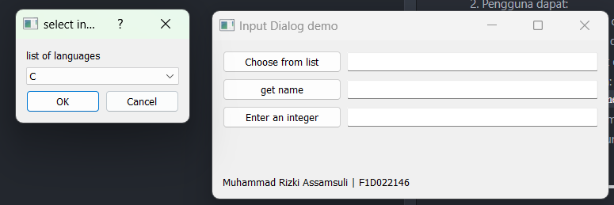
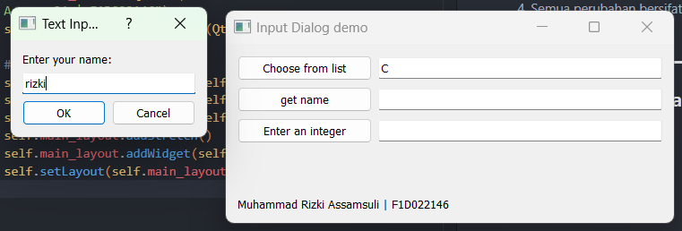
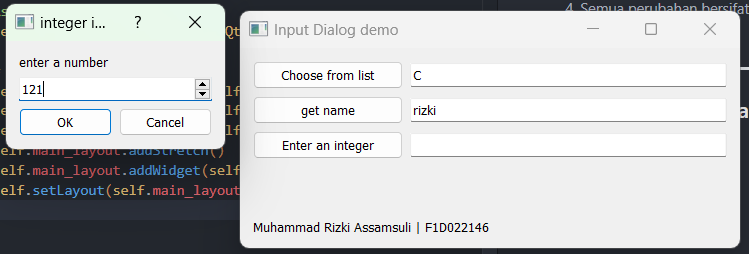
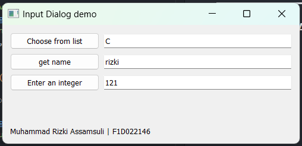

# 📥 Input Dialog App (pv25-week6)

Aplikasi ini dibuat menggunakan **PyQt5** untuk memenuhi tugas minggu ke-6 mata kuliah _Pemrograman Visual 2025_. Aplikasi ini menampilkan berbagai jenis input dialog untuk mendapatkan data dari pengguna, lalu menampilkannya secara ringkas di bagian bawah antarmuka.

- **Nama:** Muhammad Rizki Assamsuli
- **NIM:** F1D022146

---

## 🎯 Tujuan Aplikasi

Membuat antarmuka interaktif dengan komponen PyQt5 seperti:

- `QInputDialog` untuk mengambil input dari pengguna.
- `QLineEdit` untuk menampilkan hasil input langsung.
- `QLabel` untuk menampilkan ringkasan hasil input secara terpusat.
- Pemisahan antara **UI** dan **logika aplikasi** agar kode lebih modular dan mudah dirawat.

---

## 🛠️ Fitur Aplikasi

1. **Tiga jenis input**:
   - **List Input** → Memilih bahasa pemrograman dari daftar (C, C++, Java, Python).
   - **Text Input** → Mengisi nama pengguna.
   - **Integer Input** → Mengisi angka bebas.
2. **Menampilkan hasil input** secara ringkas di bagian bawah tampilan.
3. **Antarmuka sederhana dan interaktif** menggunakan PyQt5.
4. Struktur kode mengikuti pola pemisahan **View** dan **Presenter**.

---

## 🧩 Alur Kerja Aplikasi

1. Aplikasi dijalankan dan jendela utama ditampilkan.
2. Pengguna dapat:
   - Memilih bahasa dari daftar dropdown.
   - Mengisi nama lewat dialog teks.
   - Mengisi angka lewat dialog bilangan bulat.
3. Input yang diterima akan:
   - Ditampilkan di `QLineEdit` masing-masing.
   - Dirangkum dan ditampilkan di bawah sebagai hasil akhir.
4. Semua perubahan langsung diperbarui secara real-time saat input berhasil diberikan.

---

## 📷 Hasil Run Aplikasi

---
